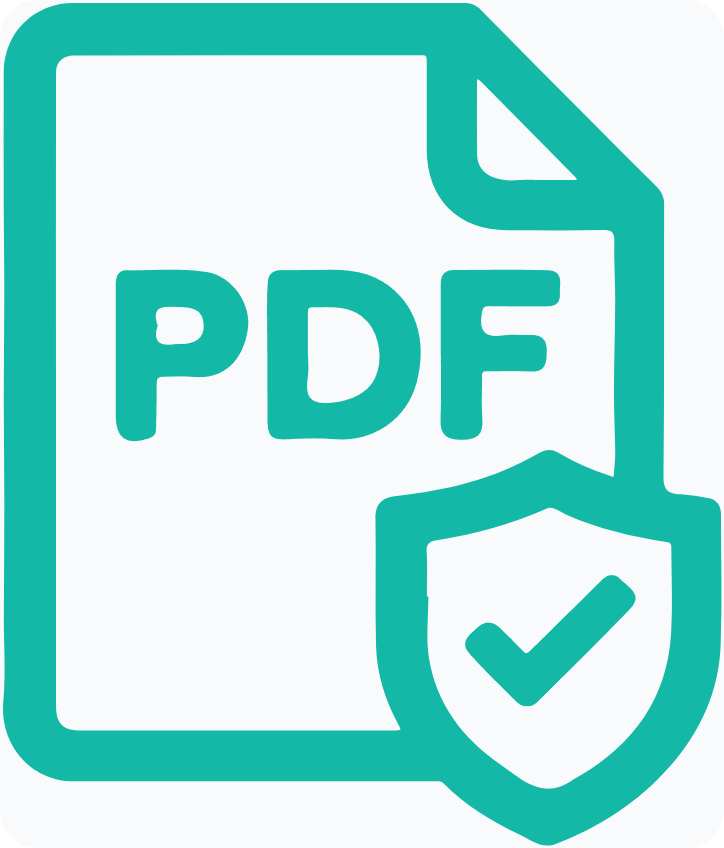
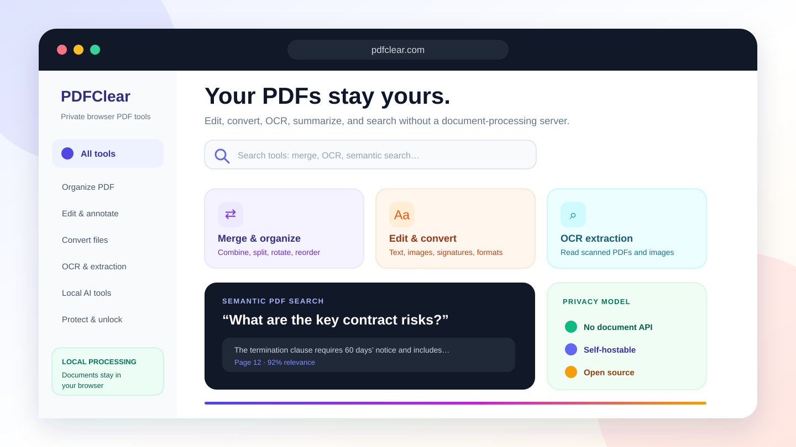

<div align="center">
  

# PDFClear

**Open-source, privacy-first PDF tools with browser-side editing, conversion, OCR, summarization, and semantic search.**

Your files stay on your device and are processed directly in your browser. AI and OCR features load their required assets once, then you can disconnect and keep working offline.

[Live demo](https://www.pdfclear.com) · [Privacy model](PRIVACY.md) · [Self-hosting](#docker-quick-start) · [Roadmap](ROADMAP.md)

[](https://github.com/aliansari22/pdfclear/actions/workflows/ci.yml)
[](https://github.com/aliansari22/pdfclear/releases)
[](LICENSE)
[](#docker-quick-start)
[](https://www.typescriptlang.org/)
[](https://buymeacoffee.com/pdfclear)

</div>



## Why PDFClear?

Most online PDF services require documents to be uploaded to a remote processing service. PDFClear takes a different approach: the application, PDF libraries, OCR workers, and compatible AI runtimes execute in the browser.

- **Browser-side document processing:** PDF and image content stays in the active browser workflow.
- **Open source and self-hostable:** Review the source, deploy the static application, and host compatible model assets yourself.
- **A complete practical toolkit:** Organize, edit, convert, protect, extract, OCR, summarize, and search documents in one interface.
- **No account required:** Open the application and start working.

## Features

### Organize and optimize

- Merge, split, reorder, rotate, flip, and delete PDF pages.
- Compress PDFs and edit document metadata.
- Protect PDFs with a password or unlock files when you have the password.

### Edit and annotate

- Add text, images, signatures, watermarks, and page numbers.
- Fill supported PDF forms in the browser.
- Preview visual edits before exporting.

### Convert and extract

- Convert JPG, PNG, TXT, HTML, and Markdown to PDF.
- Convert PDF pages to JPG or PNG.
- Extract text from standard PDFs and scanned files with OCR.
- Convert PDFs to Markdown.

### Local AI workflows

- Summarize PDF and text documents with a browser-compatible model.
- Run semantic PDF search using local embeddings and natural-language queries.
- Reuse cached model assets when supported by the browser and deployment.

## Privacy model

PDFClear processes uploaded documents directly in the browser, so your files stay on your device.

The browser may still make requests for:

- Application JavaScript, CSS, images, and manifest files.
- PDF and WebAssembly runtimes.
- OCR workers and language data.
- AI model, tokenizer, configuration, and runtime files.
- An optional self-hosted Unicode font.

AI and OCR tools load these supporting assets before use. Once they are loaded, you can disconnect from the internet and continue working offline.

Read [`PRIVACY.md`](PRIVACY.md) for the full model and [`docs/model-assets.md`](docs/model-assets.md) for self-hosted AI/OCR assets.

## Quick start

Requirements:

- Node.js 20 or newer.
- npm.

Install and run the development server:

```bash
npm ci
npm run dev
```

Open `http://localhost:4000`.

Run the complete project check:

```bash
npm run check
```

Build production assets:

```bash
npm run build
```

Generate the production build plus `robots.txt` and `sitemap.xml`:

```bash
npm run build:site
```

## Docker quick start

Build and run the production image:

```bash
docker build -t pdfclear .
docker run --rm -p 8080:8080 pdfclear
```

Then open `http://localhost:8080`.

Alternatively:

```bash
docker compose up --build
```

The container serves the static Vite build with unprivileged nginx on port 8080.

## Configuration

Copy `.env.example` to an uncommitted `.env` file when changing deployment settings.

| Variable | Purpose | Default |
| --- | --- | --- |
| `VITE_SITE_URL` | Public site origin used by shared links | `https://www.pdfclear.com` |
| `VITE_GITHUB_REPOSITORY_URL` | Repository URL used by website GitHub links | `https://github.com/aliansari22/pdfclear` |
| `VITE_TRANSFORMERS_REMOTE_MODELS` | Allow compatible remote model downloads | `true` |
| `VITE_TRANSFORMERS_LOCAL_MODELS` | Enable local/self-hosted model lookup | `false` |
| `VITE_TRANSFORMERS_LOCAL_MODEL_PATH` | Base path for self-hosted model assets | `/models/` |
| `VITE_PDF_CUSTOM_FONT_URL` | Optional self-hosted TrueType font for broader Unicode coverage | empty |

Do not place secrets in `VITE_*` variables. Vite embeds them in the browser bundle.

## Architecture

PDFClear is a React 19 and TypeScript single-page application built with Vite. Major browser-side components include:

- PDF.js and pdf-lib for reading and manipulating PDFs.
- qpdf-wasm for supported PDF security operations.
- Tesseract.js for OCR.
- Transformers.js for compatible local AI workflows.
- DOMPurify for sanitizing HTML and Markdown conversion input.
- A Web Worker for expensive PDF operations where supported.

Large AI/OCR assets are intentionally excluded from the source repository. The application loads them on demand or from a self-hosted path configured by the deployer.

## Browser and resource considerations

PDFClear works best in current desktop versions of Chromium, Firefox, and Safari. Exact support varies by tool because browser APIs, WebAssembly capabilities, available memory, and model caching differ.

Large PDFs, high-resolution OCR, and local AI can require substantial memory and processing time. There is no remote processing quota in the source application, but practical limits are determined by the user's device and browser.

## Project scripts

| Command | Description |
| --- | --- |
| `npm run dev` | Start Vite on port 4000 |
| `npm run typecheck` | Run TypeScript without emitting files |
| `npm run build` | Create the production Vite build |
| `npm run build:site` | Build and generate sitemap/robots files |
| `npm run check` | Run type checking and production build |
| `npm run generate:og` | Generate route Open Graph images when Chrome is available |
| `npm run clean` | Remove local Vite cache and generated build output |

The project `.npmrc` sets `ignore-scripts=true`, preventing normal installs from downloading native runtimes or browser binaries that the browser application does not need.

## Contributing

Contributions are welcome. Start with [`CONTRIBUTING.md`](CONTRIBUTING.md), review [`ROADMAP.md`](ROADMAP.md), and look for tightly scoped issues labeled `good first issue` or `help wanted`.

For visible UI changes, include a screenshot or short recording. Do not include private documents in issues, test fixtures, or pull requests.

## Security

PDFClear handles untrusted documents, HTML, Markdown, OCR output, and WebAssembly. Treat all inputs as hostile and review network or parsing changes carefully.

Report vulnerabilities privately by following [`SECURITY.md`](SECURITY.md). Do not open a public issue containing exploit details or sensitive files.

## Release and launch notes

Maintainers can use [`docs/github-launch.md`](docs/github-launch.md) for repository topics, social preview setup, release preparation, and announcement positioning. The upload-ready 1280 × 640 social image is available at [`docs/assets/github-social-preview.png`](docs/assets/github-social-preview.png).

## License

Licensed under the [Apache License 2.0](LICENSE). See [`NOTICE`](NOTICE) for attribution information.
